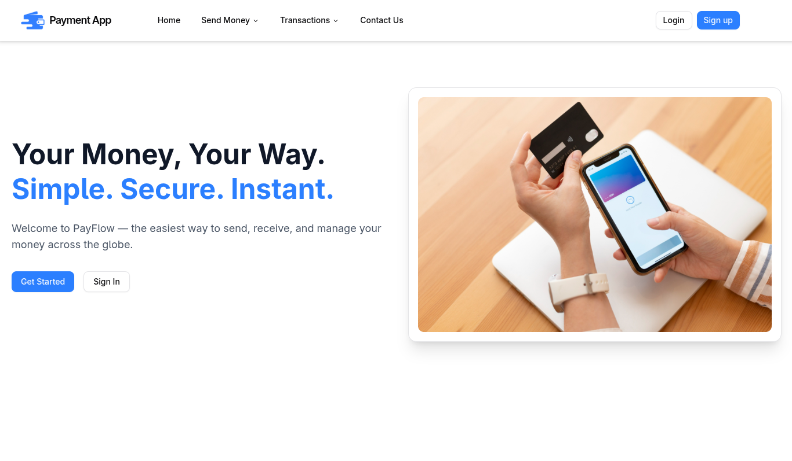
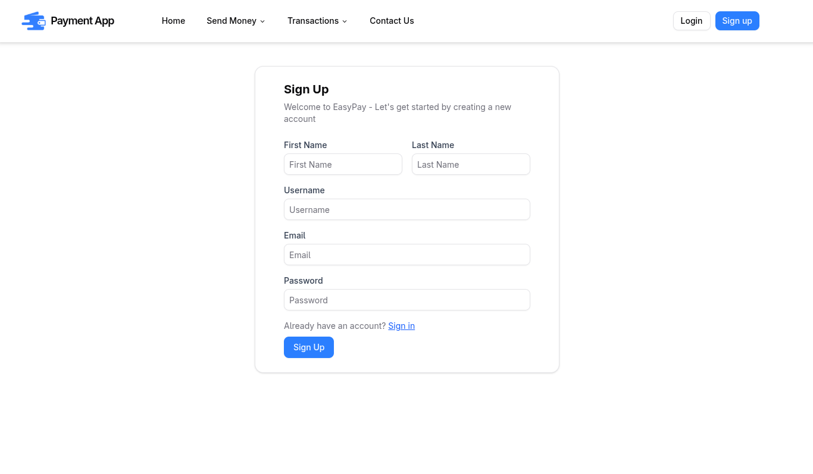
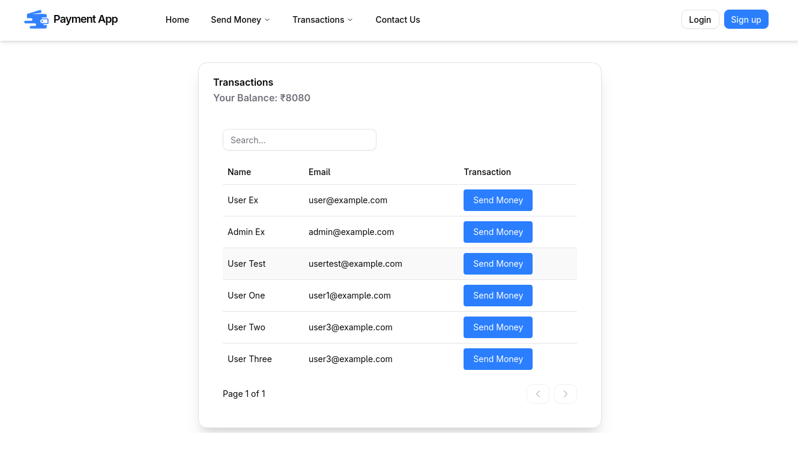

# 💳 Simple Payment App

A simple full-stack payment app built with React, Express, MongoDB, and JWT — just for fun and learning! It lets users sign up, log in, and (pretend to) send money. Great little project to practice building real-world features like auth, protected routes, and API handling from scratch.


## Features

- **JWT Authentication** – Secure login system using access tokens
- **MongoDB Integration** – Stores user data and future payment records
- **Form Validation** – Client-side with React Hook Form and Zod
- **REST API** – Clean API structure for handling auth and payments
- **Modular Frontend** – Built with reusable React components and hooks
- **Environment Configuration** – Uses dotenv for safe env variable management
- **Responsive Design** – Works seamlessly on desktop and mobile devices

## Tech Stack

### Frontend:

- React (Vite)
- React Hook Form
- Zod
- Axios
- Tailwind CSS

### Backend:

- Node.js + Express
- MongoDB (via Mongoose)
- JWT (JSON Web Tokens)
- bcryptjs
- dotenv
- CORS

## Project Structure

```plaintext
simple-payment-app/
├── frontend/               # React frontend
│   ├── public/
│   ├── src/
│   │   ├── components/     # Reusable UI components
│   │   ├── pages/          # Page components
│   │   ├── lib/            # Utility functions
│   │   ├── main/           # Entry Point
│   │   └── styles/         # CSS/Tailwind files
│   ├── package.json
│   └── vite.config.js
├── backend/                # Express backend
│   ├── db/                 # MongoDB models
│   ├── routes/             # API routes
│   ├── middleware/         # Custom middleware
│   ├── config/             # Database and app config
│   ├── package.json
│   └── index.js
└── README.md
```

## Getting Started

### Prerequisites

- Node.js (v14 or higher)
- MongoDB (local or Atlas)
- npm or any package managment library

### Installation

1. **Clone the repository**
   ```bash
   git clone https://github.com/viveksahux/simple-payment-app.git
   cd simple-payment-app
   ```
2. **Setup Backend**
   ```bash
   cd backend
   npm install
   ```
3. **Setup Frontend**
   ```bash
   cd ../frontend
   npm install
   ```
4. **Environment Configuration**  
   Create a .env file in the backend directory:
   ```
   PORT=your_prefered_port || 5000
   MONGODB_URI=your_mongodb_connection_string
   JWT_SECRET=your_jwt_secret_key
   SALT_ROUNDS=your_preferred_salt_rounds_value
   ```
   Create a .env file in the frontend directory:
   ```
   VITE_API_BASE_URL=http://localhost:5000/api
   VITE_APP_NAME=paymentApp
   ```
5. **Start the Application: **  
   Start the backend server:
   ```
   cd backend
   npm start
   ```
   In a new terminal, start the frontend:
   ```
   cd frontend
   npm run dev
   ```
6. **Access the Application**  
   Open your browser and navigate to:
   ```
   Frontend: http://localhost:3000
   Backend API: http://localhost:5000
   ```

## API Endpoints (Examples)

| Method | Endpoint                  | Description          | Authentication |
| ------ | ------------------------- | -------------------- | -------------- |
| POST   | `/api/v1/user/signup`     | User registration    | Public         |
| POST   | `/api/v1/user/signin`     | User login           | Public         |
| POST   | `/api/v1/user/users`      | Query to get users   | Required       |
| POST   | `/api/v1/user/modifypass` | Modify user password | Required       |
| GET    | `/api/payments/balance`   | Get account balance  | Required       |
| POST   | `/api/payments/transfer`  | Transfer amount      | Required       |

## Security Features

- Passwords hashed with bcryptjs
- JWT tokens for authentication
- Protected API routes
- Input validation and sanitization
- CORS configuration

## Screenshots

<p align="center">
  
  
  
</p>

## Future Enhancements (For Learning & Fun)

- Transaction History
- Two-Factor Authentication (2FA)
- Switch to PostgreSQL
- Email Integration
- Dark Mode
- Mobile Responsiveness
- User Avatars

> This project is just for fun and learning, so future features will be added based on curiosity and experimentation 😄
